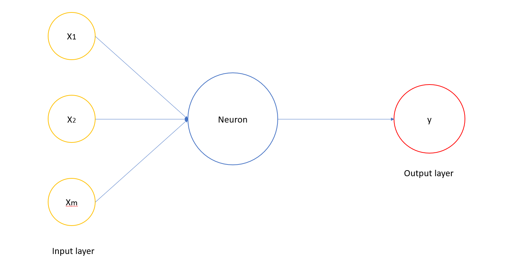

<h1 style="text-align: justify;"><strong>1-Artificial Neural Networks</strong></h1>  

#NỘI DUNG
1. [Neuron](#0)
2. [Activation function](#1)
3. [Neural Network hoạt động như thế nào?](#2)  
4. [Neural Network học như thế nào?](#3)
5. [Gradient Descent](#4)
6. [Stochastic Gradient Descent (SGD)](#5)
7. [Backpropagation](#6)

## 1.Neuron 
Deep Learning đã trở thành một chủ đề nóng trong vài năm trở lại đây, nó là lĩnh vực được ngày càng nhiều sinh viên Việt Nam tìm hiểu và nghiên cứu. Vậy có gì đặc biệt và khác gì với Machine Learning? Chúng ta hãy tìm hiều trong bài viết này..  

_(Do là bài viết đầu tiên nên sẽ có sai xót, xin chân thành cảm ơn những lời đóng góp nhận xét của mọi người.)_  

  

## 2.Activation function 
The first paragraph text

## 3.Neural Network hoạt động như thế nào? 
This is a sub paragraph, formatted in heading 3 style

## 4.Neural Network học như thế nào?   

## 5.Gradient Descent   

## 6.Stochastic Gradient Descent (SGD)   

## 7.Backpropagation   

[jekyll]:      http://jekyllrb.com
[jekyll-gh]:   https://github.com/jekyll/jekyll
[jekyll-help]: https://github.com/jekyll/jekyll-help
